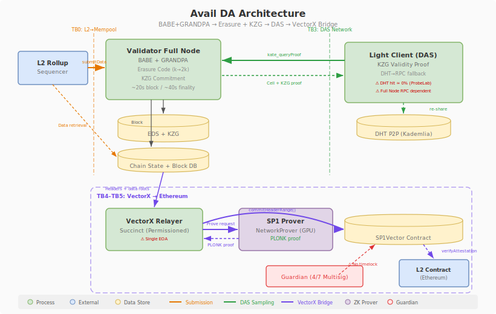

# Avail

Avail is a Substrate-based data availability blockchain using Nominated Proof-of-Stake (NPoS) consensus with BABE block production and GRANDPA finality. It features a KZG commitment scheme (using the Filecoin Powers of Tau ceremony) for data validity proofs and light client DAS for availability verification. The VectorX bridge relays Avail validator set and data commitments to Ethereum via SP1 ZK proofs, enabling L2s on Ethereum to verify Avail DA attestations. The AVAIL token lives on Ethereum with mint/burn authority held by the Bridge contract.

The threat analysis focuses heavily on the bridge infrastructure (VectorX, SP1VerifierGateway, Bridge, multisig governance) due to the critical trust boundary between the Avail chain and Ethereum settlement.

## Architecture

## Threat Summary

14 threats identified through on-chain verification (cast/RPC), source code analysis, and Anvil mainnet fork PoC testing. All threats are scored using the Halborn BVSS 1.1 framework.

| SID | Threat | Severity | Status |
|-----|--------|----------|--------|
| [AVL-E03](threats/avl-e03.md) | Deployer EOA Retains DEFAULT_ADMIN_ROLE -- Solo VectorX Upgrade Possible | High (8.4) | verified |
| [AVL-D01](threats/avl-d01.md) | VectorX Single Relayer SPOF -- No On-Chain Rate Limit or Heartbeat | Medium (6.6) | verified |
| [AVL-T05](threats/avl-t05.md) | KZG Trusted Setup (Filecoin PoT, 1-of-N Honest Assumption) | Medium (5.3) | unverified |
| [AVL-D02](threats/avl-d02.md) | Validator Set 105/1200 -- Nakamoto Coefficient ~34, 8.75% Utilization | Medium (5.3) | verified |
| [AVL-E04](threats/avl-e04.md) | Technical Committee Runtime Upgrade (5/5 or 5/7 Consensus) | Low (3.7) | verified |
| [AVL-T01](threats/avl-t01.md) | VectorX Instant Upgrade (4/7 Multisig, No Timelock) | Low (2.5) | verified |
| [AVL-E01](threats/avl-e01.md) | SP1VerifierGateway 2/3 Multisig -- Verifier Route Tampering | Low (1.8) | verified |
| [AVL-T03](threats/avl-t03.md) | AVAIL Token Unlimited Mint via Bridge Upgrade | Low (1.8) | verified |
| [AVL-T04](threats/avl-t04.md) | Guardian updateBlockRangeData() -- ZK Proof Bypass (Intended Emergency Mechanism) | Low (1.8) | verified |
| [AVL-I01](threats/avl-i01.md) | Block Reconstruction Incomplete -- DAS Security Guarantee Theoretical | Low (0.8) | unverified |
| [AVL-E02](threats/avl-e02.md) | Multisig Key Holder Triple Overlap (Gov + Pauser + SP1) | Low (0.5) | verified |
| [AVL-R01](threats/avl-r01.md) | Slashing Infrastructure Exists but Never Triggered in 688 Eras | Low (0.3) | verified |
| [AVL-T02](threats/avl-t02.md) | Bridge 24h Timelock -- Relatively Safe, Limited Risk | Low (0.3) | verified |
| [AVL-S01](threats/avl-s01.md) | TimelockedUpgradeable Naming Deception -- No Actual Timelock | Informational (0.0) | verified |

## Key Findings

### AVL-E03: Deployer EOA DEFAULT_ADMIN_ROLE Residual (High, BVSS 8.4)

The deployer EOA (0xDEd0...E18e) retains `DEFAULT_ADMIN_ROLE` on the VectorX contract. While `TIMELOCK_ROLE` and `GUARDIAN_ROLE` were revoked from this address, `DEFAULT_ADMIN_ROLE` is the admin role for both, meaning the deployer can single-handedly execute `grantRole(TIMELOCK_ROLE, self)` followed by `upgradeTo(malicious)` in just 2 transactions. The revoke code in the deployment script (`Guardian.s.sol`) was found commented out. The deployer is an active EOA with nonce 1107.

### AVL-D01: VectorX Relayer SPOF (Medium, BVSS 6.6)

A single EOA (0x27BF...787D) serves as the sole approved relayer for VectorX. The on-chain contract has zero rate limiting, heartbeat monitoring, or staleness detection mechanisms (confirmed by full source code review including inheritance chain). The relayer client controls relay intervals purely on the client side (`LOOP_INTERVAL_MINS=60`). There is no mechanism to propose new relayers (confirmed by L2BEAT). If this EOA goes offline or is compromised, DA attestation bridging to Ethereum halts completely.

### AVL-E02: Multisig Key Holder Overlap (Low, BVSS 0.5)

Critical governance independence is undermined by key holder overlap across three multisigs:
- **Pauser Multisig** (3/5): 4 of 5 owners are identical to Governance Multisig 1 owners
- **SP1VerifierGateway** (2/3): 1 owner (0x72Ff...4f54) appears in all three multisigs
- Address 0x72Ff...4f54 participates in Governance (#4), Pauser (#4), and SP1 (#2)

A compromise of the Governance multisig automatically cascades to Pauser and SP1 verifier control.

### AVL-S01: TimelockedUpgradeable Naming Deception (Informational)

The `TimelockedUpgradeable` base contract used by VectorX contains no actual timelock logic -- no delay, no queue/execute pattern. It is purely an AccessControl wrapper where `onlyTimelock` is simply `hasRole(TIMELOCK_ROLE, msg.sender)`. This naming creates a false sense of security for auditors and integrators reviewing the upgrade path.

## PoC Evidence

All on-chain findings were verified through direct `cast` calls and Anvil mainnet fork testing. See [PoC Evidence](poc/README.md) for detailed verification methodology and test scripts.

## Bridge-Focused Analysis

The Avail threat model is intentionally bridge-centric. The VectorX + SP1VerifierGateway + Bridge + AVAIL Token chain represents the primary trust boundary where Avail DA guarantees are consumed by Ethereum-based systems. Key observations:

- **VectorX** has no timelock (unlike Bridge which has 24h)
- **Deployer EOA** can bypass all multisig governance via residual admin role
- **Relayer** is a single point of failure with no on-chain health monitoring
- **Multisig independence** is weakened by key holder overlap across 3 multisigs
