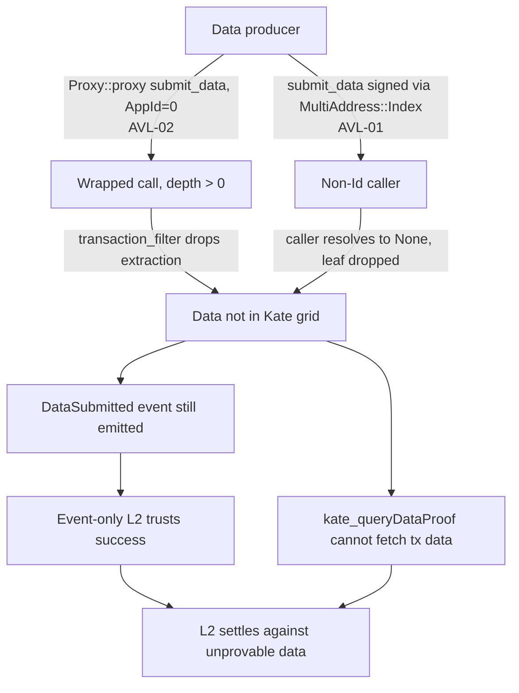
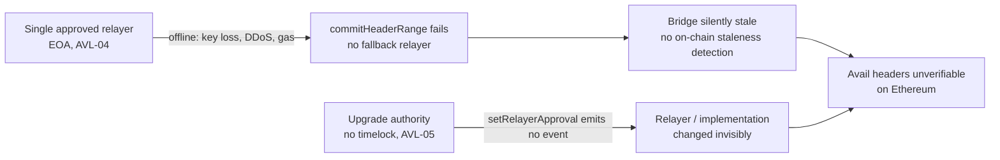

# Avail Attack Chains

This page documents two attack chains against Avail and its VectorX bridge, constructed by composing individual threat findings. Runtime behavior comes from the proof-of-concept results on the referenced threat pages; bridge parameters come from on-chain data (see [Verification Evidence](evidence.md)).

---

## Attack Chain A: Phantom Availability

**Composed from:** AVL-02 (proxy-wrapped submitData extraction bypass), AVL-01 (MultiAddress::Index proof omission)

Both findings let a transaction be included on Avail while its data is excluded from the Kate commitment the bridge attests to. An event-only consumer that trusts the success event then settles against data that cannot be proven available.

### Preconditions

| Parameter | Value | Source |
|---|---|---|
| `AppId(0)` validation | Short-circuited (no registration needed) | AVL-02 |
| Proxy recursion guard | Lacks `submit_data` block | AVL-02 |
| Extraction at depth > 0 | Returns `None` (no extraction) | AVL-02 |
| `MaybeCaller::caller()` for non-Id | Returns `None`, bridge leaf dropped | AVL-01 |
| Consumer trust model | Event-only (trusts `DataSubmitted`) | AVL-01, AVL-02 |

### Attack Steps

1. **Wrap the submission**: The producer submits data either wrapped in `Proxy::proxy` with `AppId(0)` (AVL-02) or signed through a `MultiAddress::Index` origin (AVL-01).

2. **Extraction skipped**: In both cases the runtime executes `submit_data` and emits a successful `DataSubmitted` event, but the data is never placed in the Kate grid, so it is absent from the data root.

3. **Proof fails silently**: `kate_queryDataProof` cannot fetch the transaction data, yet the on-chain event reports success.

4. **Downstream trust**: An event-only L2 that treats `DataSubmitted` as proof of availability settles against data that no one can prove was published.

### Cost

| Component | Amount |
|---|---|
| Privilege | None (any account, `AppId(0)`) |
| On-chain cost | Standard extrinsic fee |

### Impact

- Data appears committed on Avail but is absent from the data root the bridge verifies.
- Event-only consumers cannot distinguish a genuine submission from a phantom one.
- This is an integrity gap in the data-availability guarantee, recorded against the Retrievability and Verifiability axes.

---

## Attack Chain B: Bridge Halt and Silent Reconfiguration

**Composed from:** AVL-04 (single relayer SPOF), AVL-05 (VectorX instant upgrade, no timelock)

### Preconditions

| Parameter | Value | Source |
|---|---|---|
| Approved relayers | 1 EOA, `checkRelayer` enabled | AVL-04 |
| Staleness detection | None (no `block.timestamp` reference) | AVL-04 |
| `setRelayerApproval` events | None emitted | AVL-04 |
| Upgrade timelock | None | AVL-05 |
| Commit cadence | ~120 minutes, ~358 blocks per batch | AVL-04 |

### Attack Steps

1. **Relayer loss**: The single approved relayer goes offline through infrastructure failure, key compromise, gas exhaustion, or a targeted DDoS. No other address is authorized to call `commitHeaderRange()`.

2. **Silent staleness**: The contract has no heartbeat or timeout, so the bridge goes stale with no on-chain signal. Avail headers stop being verified on Ethereum.

3. **Invisible reconfiguration**: Because `setRelayerApproval()` emits no event and upgrades carry no timelock, a relayer swap or implementation change is not visible to off-chain monitoring before it takes effect.

### Cost

| Component | Amount |
|---|---|
| Attacker action | None required for the halt (natural failure suffices) |
| Time delay | None on reconfiguration (no timelock) |

### Impact

- A single relayer failure halts the entire Ethereum-side verification path while the Avail chain keeps producing blocks.
- The absence of events and timelock removes the window for the community to observe and react to relayer or implementation changes.
- Recorded against the Liveness and Verifiability axes as operational and governance conditions.

---

## Summary Matrix

| Attack Chain | Privilege | Impact Scope | Composed Findings | Assessment |
|---|---|---|---|---|
| A: Phantom Availability | None | DA integrity for event-only consumers | AVL-02, AVL-01 | Integrity gap: data committed but unprovable |
| B: Bridge Halt | None (halt) / upgrade authority (reconfig) | Ethereum-side verification | AVL-04, AVL-05 | Liveness SPOF with invisible reconfiguration |
