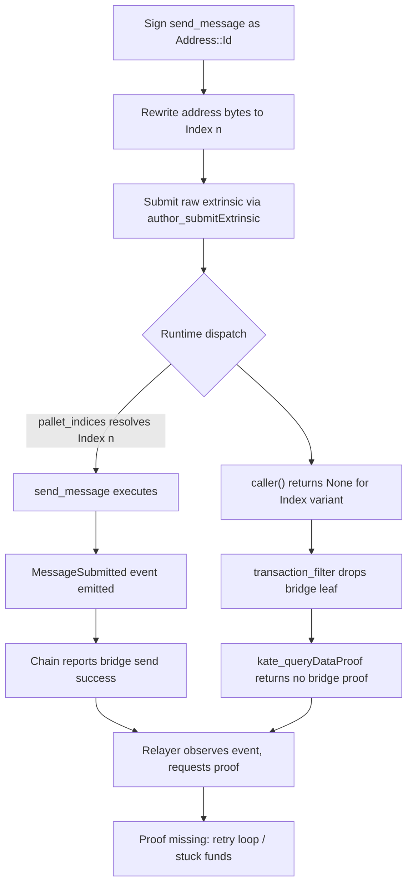

# AVL-01: MultiAddress::Index Signing Causes Silent Bridge Proof Omission


**Severity**: High (8.5/10) · **Category**: Vulnerability · **Status**: poc_verified


## Summary

When `Vector::send_message` is submitted under a `MultiAddress::Index(n)` signature, the Avail runtime emits a successful message-submission event while the bridge proof is never written into the header extension. Two independent defects combine: `MaybeCaller::caller()` returns `None` for every address variant other than `MultiAddress::Id`, and the bridge leaf extraction in `transaction_filter.rs` drops the leaf whenever the caller is `None`. Because the SCALE `UncheckedExtrinsic` signing payload excludes the address, a transaction signed as `Address::Id` stays valid after its address bytes are rewritten to `Index`, so the omission is reachable on a runtime that resolves the index to a valid account.

## Description



The vulnerability requires the combination of two defects.

**Defect 1 — `caller()` returns `None` for non-`Id` variants.** The runtime resolves `Index(n)` to a concrete account through `pallet_indices` and dispatches successfully, but `MaybeCaller::caller()` does not know the resolved account and returns `None`.

```rust
// avail-core/core/src/asdr.rs
// @audit caller() returns Some only for MultiAddress::Id; Index/Raw/Address32/Address20 all return None
// https://github.com/availproject/avail/blob/510ee26dde6c3e678a8b8f1726dd99039de39276/avail-core/core/src/asdr.rs
impl MaybeCaller<AccountId> for AppUncheckedExtrinsic<MultiAddress<...>> {
    fn caller(&self) -> Option<&AccountId> {
        match sig.0 {
            MultiAddress::Id(ref id) => Some(id),
            _ => None,
        }
    }
}
```

**Defect 2 — bridge leaf dropped when caller is `None`.** The leaf builder applies the `?` operator to `caller`, so a `None` caller causes the whole function to return `None` and the bridge leaf never reaches the header extension.

```rust
// runtime/src/transaction_filter.rs:127
// @audit *caller? short-circuits to None, dropping the bridge leaf for Index-signed send_message
// https://github.com/availproject/avail/blob/510ee26dde6c3e678a8b8f1726dd99039de39276/runtime/src/transaction_filter.rs
let from: [u8; 32] = *caller?.as_ref();
let id = tx_uid(block, tx_index);
let msg = AddressedMessage::new(message.clone(), H256(from), *to, 1, *domain, id);
```

**Signature validity.** The SCALE `UncheckedExtrinsic` signing payload is `(call_bytes, extra, additional_signed)` and does not include the address. A transaction signed as `Address::Id` therefore stays valid after only its address bytes are replaced with `0x01 + compact_index`, and the runtime resolves the index back to the original account.

## Proof of Concept

End-to-end reproduction confirmed the silent omission on an Avail development network running the same runtime as mainnet.

- **Environment**: Avail Development Network, runtime commit `510ee26dde6c3e678a8b8f1726dd99039de39276`, specVersion 51, binary `availj/avail:v2.3.4.3`.
- **Baseline**: `send_message` signed as `Address::Id` emitted `MessageSubmitted` and produced a bridge proof retrievable via `kate_queryDataProof`.
- **Attack**: the same call signed as `Address::Index(0)` emitted `MessageSubmitted` while `kate_queryDataProof` returned no bridge proof.
- **Mainnet preconditions**: `state_getRuntimeVersion` on `mainnet-rpc.avail.so` reports specVersion 51, the `Indices` and `Vector` pallets are present, and `vector.whitelistedDomains()` returns an active domain. Claiming an index requires a 10 AVAIL deposit.

## Impact

The bridge records a message as sent while no proof is ever produced, so the on-chain success event and the verifiable bridge state diverge. A relayer that subscribes to `MessageSubmitted` requests a proof that does not exist, producing failed lookups and retry loops. Funds committed on the Avail side become stuck without a corresponding proof on the destination chain. The attacker bears the index deposit and gas on every attempt and gains no direct theft of third-party funds, which limits the economic incentive, but the integrity gap between the emitted event and the missing proof is real and reachable by any account able to claim an index.

### CVSS 3.1

**Score**: 8.5/10 (High)
**Vector**: `CVSS:3.1/AV:N/AC:L/PR:L/UI:N/S:C/C:N/I:H/A:L`

| Metric | Value | Rationale |
|--------|-------|-----------|
| AV (Attack Vector) | N (Network) | Raw extrinsic is submitted over RPC |
| AC (Attack Complexity) | L (Low) | Address-byte substitution is deterministic once the encoding is understood |
| PR (Privileges Required) | L (Low) | Attacker needs a funded account to claim an index and pay the deposit |
| UI (User Interaction) | N (None) | No user interaction required |
| S (Scope) | C (Changed) | The runtime extrinsic filter is the vulnerable component; the impacted component is the bridge proof system and downstream relayers |
| C (Confidentiality) | N (None) | No confidentiality impact |
| I (Integrity) | H (High) | A success event is emitted for a message whose bridge proof is never produced |
| A (Availability) | L (Low) | Relayers waste resources retrying for a proof that never appears |

## Recommendation

1. Resolve the account from the address variant when `caller()` is `None`, so `transaction_filter.rs` extracts the bridge leaf for index-signed `send_message` calls.
2. Alternatively, reject `send_message` calls that are not signed with `MultiAddress::Id`, returning a custom invalid-transaction error before dispatch.
3. Add a regression test that submits `send_message` under each `MultiAddress` variant and asserts that a bridge proof is produced whenever `MessageSubmitted` is emitted.
