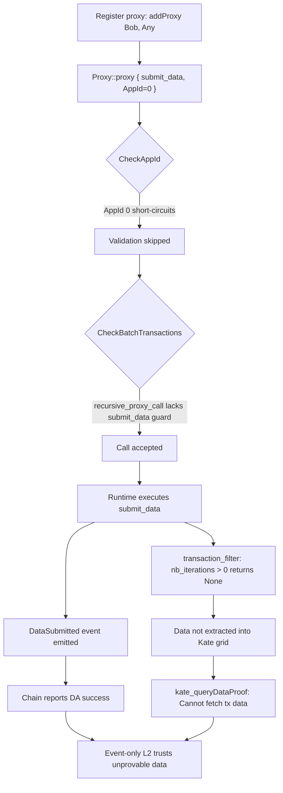

# AVL-02: Proxy-Wrapped submitData Bypasses Data Availability Extraction


**Severity**: High (7.7/10) · **Likelihood**: Moderate · **Category**: Vulnerability · **Status**: poc_verified


## Summary

When `DataAvailability::submit_data` is wrapped in `Proxy::proxy`, the Avail runtime emits a successful `DataSubmitted` event while the data is never included in the Kate commitment. Two defects combine: the `recursive_proxy_call` guard in `CheckBatchTransactions` lacks the `submit_data` block that `recursive_batch_call` enforces, and `transaction_filter.rs` unconditionally drops data extraction for any wrapped call where the wrapping depth is greater than zero. With an `AppId` of 0, which short-circuits all app-id validation, any account can submit data that appears committed on-chain but is absent from the data availability proof.

## Description



The vulnerability requires the combination of three behaviors.

**App-id short-circuit.** `CheckAppId` returns early for `AppId(0)`, skipping all app-id validation. Any user may set this value with no registration or privilege.

```rust
// pallets/dactr/src/extensions/check_app_id.rs:76
// @audit AppId(0) bypasses all app-id validation
// https://github.com/availproject/avail/blob/510ee26dde6c3e678a8b8f1726dd99039de39276/pallets/dactr/src/extensions/check_app_id.rs
if self.app_id() == AppId(0) {
    return Ok(());
}
```

**Asymmetric proxy guard.** The batch path blocks `submit_data`, but the proxy path blocks only `send_message`, leaving `submit_data` reachable through `Proxy::proxy`.

```rust
// pallets/dactr/src/extensions/check_batch_transactions.rs
// @audit recursive_batch_call blocks submit_data (line 193); recursive_proxy_call does not (line 232)
// https://github.com/availproject/avail/blob/510ee26dde6c3e678a8b8f1726dd99039de39276/pallets/dactr/src/extensions/check_batch_transactions.rs
fn recursive_batch_call(...) {
    ensure!(!call.is_submit_data_call(),
        InvalidTransaction::Custom(UnexpectedSubmitDataCall as u8));
}
fn recursive_proxy_call(...) {
    ensure!(!call.is_send_message_call(), ...);
    // no submit_data guard
}
```

**Wrapped-call extraction drop.** Data extraction is skipped whenever the wrapping depth is non-zero, so the proxy-wrapped call produces a `DataSubmitted` event without contributing to the Kate commitment.

```rust
// runtime/src/transaction_filter.rs:38
// @audit nb_iterations > 0 (proxy/multisig wrapping) drops the call from DA extraction
// https://github.com/availproject/avail/blob/510ee26dde6c3e678a8b8f1726dd99039de39276/runtime/src/transaction_filter.rs
if nb_iterations > 0 {
    None
}
```

## Proof of Concept

End-to-end reproduction confirmed the bypass on an Avail development network running the same runtime as mainnet.

- **Environment**: Avail Development Network, runtime commit `510ee26dde6c3e678a8b8f1726dd99039de39276`, specVersion 51, binary `availj/avail:v2.3.4.3`.
- **Baseline**: a direct `submitData` call emitted `DataSubmitted` and produced a proof retrievable via `kate_queryDataProof`.
- **Attack**: `Proxy::proxy { submitData }` under `AppId=0` emitted `DataSubmitted` while `kate_queryDataProof` returned `Cannot fetch tx data at tx index 1`.
- **Mainnet preconditions**: `state_getRuntimeVersion` on `mainnet-rpc.avail.so` reports specVersion 51, the `Proxy` and `DataAvailability` pallets are present, and `AppId(0)` is freely usable. Registering a proxy requires roughly 13 AVAIL in deposits.

## Impact

The chain emits `DataSubmitted` for data that is absent from the Kate commitment, so any L2 or client that trusts the event without independently verifying the Kate proof will rely on data that cannot be proven available. The impact is bounded to event-only consumers; an L2 that verifies the Kate proof directly is unaffected. There is no direct theft of funds and no chain-wide outage, but the integrity guarantee that a `DataSubmitted` event implies retrievable data is broken, and the attack is available to any account at the cost of the proxy deposit and gas.

### CVSS 3.1

**Score**: 7.7/10 (High)
**Vector**: `CVSS:3.1/AV:N/AC:L/PR:L/UI:N/S:C/C:N/I:H/A:N`

| Metric | Value | Rationale |
|--------|-------|-----------|
| AV (Attack Vector) | N (Network) | Transaction is submitted over RPC |
| AC (Attack Complexity) | L (Low) | Wrapping a call in `Proxy::proxy` with `AppId=0` is straightforward |
| PR (Privileges Required) | L (Low) | Attacker needs a funded account to register a proxy and pay deposits |
| UI (User Interaction) | N (None) | No user interaction required |
| S (Scope) | C (Changed) | The runtime extension and filter are the vulnerable component; the impacted component is the data availability proof relied on by L2 consumers |
| C (Confidentiality) | N (None) | No confidentiality impact |
| I (Integrity) | H (High) | A success event is emitted for data that is never included in the Kate commitment |
| A (Availability) | N (None) | No availability impact on the node or chain |

## Recommendation

1. Add the `submit_data` guard to `recursive_proxy_call` in `check_batch_transactions.rs`, matching the existing block in `recursive_batch_call`.
2. Alternatively, include proxy-wrapped and multisig-wrapped `submit_data` calls in data extraction within `transaction_filter.rs` instead of dropping every call with non-zero wrapping depth.
3. Add a regression test asserting that a Kate proof is produced whenever a `DataSubmitted` event is emitted, including wrapped-call paths.
