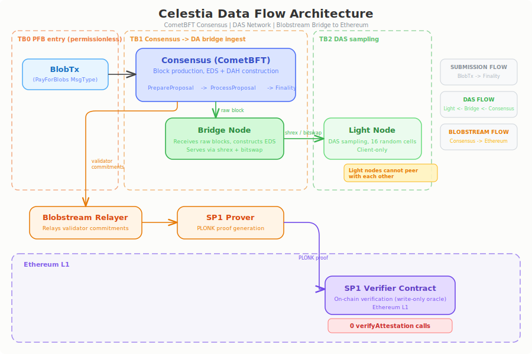

# Celestia

Celestia is a modular data availability layer purpose-built for rollups and modular blockchains. It uses CometBFT (Tendermint) consensus with a bonded validator set (94 active out of 100 max). Light nodes perform Data Availability Sampling (DAS) using 16 random samples per block to probabilistically verify data availability without downloading full blocks. The data square is constructed from Pay-For-Blob (PFB) transactions with namespace-ordered blobs, enabling namespace-level data retrieval. SP1Blobstream serves as the bridge to Ethereum, relaying Celestia validator set commitments via SP1 ZK proofs for L2 DA verification.

Note: After the shwap protocol transition, Bad Encoding Fraud Proofs (BEFPs) were removed as dead code (PR #4934, April 2026). The current light node security model is DAS-only, providing availability guarantees but not data correctness verification.

## Architecture

## Threat Summary

16 threats identified through STRIDE-based analysis, on-chain parameter verification, and source code review. Celestia threats use severity labels (not BVSS numeric scores) as the assessment framework.

| SID | Threat | Severity | Status |
|-----|--------|----------|--------|
| [CEL-E01](threats/cel-e01.md) | SP1Blobstream 4-of-6 Multisig with No Timelock on Upgrade | Critical | verified |
| [G-CON-01](threats/g-con-01.md) | KYC Validator Concentration Enabling Legal Censorship | Critical | verified |
| [CEL-T01](threats/cel-t01.md) | DAS-Only Safety Model -- Fraud Proof Removal with Stale Documentation | High | verified |
| [G-OPS-01](threats/g-ops-01.md) | Multi-Surface Information Asymmetry (docs/spec/blog vs code) | High | verified |
| [CEL-D11](threats/cel-d11.md) | pendingSeenTracker Unbounded Memory Growth via Known Account SeenTx | High | code_verified |
| [CEL-D13](threats/cel-d13.md) | CheckTx Commitment Computation Before Gas Metering -- Unbounded Blob Count | High | code_verified |
| [CEL-D17](threats/cel-d17.md) | TxCache Key Mismatch -- Blob Tx Cache Entry Permanent Leak Causing OOM | High | poc_verified |
| [CEL-D02](threats/cel-d02.md) | Large PFB Blockspace Monopoly -- Low-Cost Sustained Congestion | Medium | code_verified |
| [CEL-D03](threats/cel-d03.md) | blacklistedHashes Unbounded Memory Growth via Fake DataHash Injection | Medium | poc_verified |
| [CEL-D06](threats/cel-d06.md) | EnableBlackListing Default Disabled -- Malicious Peer Reconnection Allowed | Medium | code_verified |
| [CEL-D12](threats/cel-d12.md) | GetProposal Nil Pointer Panic on Block Sync Timing | Medium | code_verified |
| [CEL-D15](threats/cel-d15.md) | blob.Subscribe Infinite Retry Without Backoff -- CPU 100% Burn | Medium | code_verified |
| [CEL-D04](threats/cel-d04.md) | Evidence Subsystem 3 Code Defects (Hash Truncation / Buffer / Expiry Gap) | Low | code_verified |
| [CEL-D10](threats/cel-d10.md) | NamespaceData Request Worst-Case Memory Reservation on Empty Namespace | Low | code_verified |
| [CEL-D14](threats/cel-d14.md) | ProcessProposal TxCache Bypass -- Malicious Proposer Forces Full Recompute | Low | code_verified |
| [CEL-S01](threats/cel-s01.md) | DAS Selective Disclosure via Sybil Peers | Low | partial |
| [CEL-D01](threats/cel-d01.md) | Zero-cost Prevote-nil Censorship by 1/3 Cartel | Informational | verified |
| [CEL-P01](threats/cel-p01.md) | Double Sign Flat 2% Slashing -- No Correlation Penalty | Informational | verified |
| [CEL-D05](threats/cel-d05.md) | ShrEx Client-Side Response Size Unlimited -- Defensive Coding Gap | Informational | code_verified |

## Key Findings

### CEL-E01: SP1Blobstream Multisig (Critical)

The SP1Blobstream bridge contract on Ethereum is controlled by a 4-of-6 Gnosis Safe where GUARDIAN, TIMELOCK, and DEFAULT_ADMIN roles are all assigned to the same multisig address. The `initialize()` function passes the guardian address for both `_timelock` and `_guardian` parameters. Verifier and program vkey updates have no timelock, no event emission, and no review window. However, as of the verification date, zero L2s are actively using SP1Blobstream for DA verification on-chain (12,109 transactions are all `commitHeaderRange` from the relayer, with zero `verifyAttestation` calls).

### G-CON-01: Validator Concentration (Critical)

Top 8 validators hold 35.77% of voting power (exceeding the 1/3 censorship threshold), with 6 of them being KYC-regulated entities in US/EU/Swiss/HK jurisdictions. A single judicial order could compel legal censorship without any malicious intent from validators. Anchorage Digital alone holds 11.08%. The validator set is near saturation (94/100 bonded).

### CEL-D17: TxCache Key Mismatch (High, PoC Verified)

A hash key mismatch between CheckTx (uses `sha256(inner SDK tx)`) and FinalizeBlock (uses `sha256(full BlobTx wire bytes)`) causes cache entries to never be deleted. The `sync.Map`-based cache has no cap or TTL. Rejected transactions (invalid nonce/fee) are also cached at zero cost. PoC confirmed: at approximately 204 bytes per entry, a 100 Mbps rejected tx stream leaks 1 GB in roughly 160 seconds.

### CEL-D11: pendingSeenTracker Memory Exhaustion (High)

The CAT mempool's `pendingSeenTracker` has a per-signer cap of 128 entries but no global signer cap and no TTL eviction. Using known on-chain account addresses with future sequence numbers, an attacker can grow the `perSigner` map without bound. A draft PR (#3061) adds per-peer cap and TTL but is not yet merged.

## Attack Chains

Several threats form compound attack chains. For the full attack chain analysis, see [Attack Chains](attack-chains.md).

Key chain: CEL-D06 (blacklisting disabled) amplifies CEL-D03 (hash memory leak) and CEL-S01 (sybil selective disclosure) by allowing malicious peers to reconnect indefinitely after detection.
