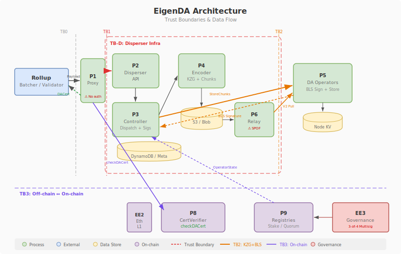

# EigenDA

EigenDA is a data availability (DA) system built as an Actively Validated Service (AVS) on EigenLayer. Operators who have restaked ETH/EIGEN on EigenLayer opt into EigenDA to provide DA guarantees. The system uses a blob dispersal model: clients submit blobs to a centralized Disperser, which erasure-codes the data into chunks, distributes them to operators, collects BLS aggregate signatures, and produces DA certificates that are verified on-chain. Retrieval is served through a Relay layer (currently a single instance) with operator-direct fallback via GetChunks.

EigenDA does not implement Data Availability Sampling (DAS). Clients rely entirely on quorum-based BLS aggregate signatures and on-chain certificate verification (55% stake threshold) rather than independent cryptographic sampling.

## Architecture

## Threat Summary

17 threats identified through STRIDE-based threat modeling, on-chain probing, and code-level verification. All threats are scored using the Halborn BVSS 1.1 framework.

| SID | Threat | Severity | Status |
|-----|--------|----------|--------|
| [EDA-T09](threats/eda-t09.md) | Ejector Role Abuse to Remove Honest Operators | High (7.0) | verified |
| [EDA-D06](threats/eda-d06.md) | Relay Single Point of Failure (1 Mainnet Instance) | Medium (6.6) | verified |
| [EDA-E03](threats/eda-e03.md) | Operator Stake Concentration Exceeding Safety/Liveness Thresholds | Medium (6.5) | verified |
| [EDA-P01](threats/eda-p01.md) | Operator Slashing Not Implemented -- Asymmetric Honesty Incentives | Medium (5.9) | verified |
| [EDA-P02](threats/eda-p02.md) | DAS Absent -- Clients Fully Dependent on Quorum Trust | Medium (5.9) | code_verified |
| [EDA-D03](threats/eda-d03.md) | Disperser V2 KZG Compute Surface Exposed Without Auth/Prepayment | Medium (5.3) | verified |
| [G-CON-03](threats/g-con-03.md) | Operator Infrastructure Concentrated in Few Cloud/ASN Providers | Medium (5.3) | verified |
| [EDA-S03](threats/eda-s03.md) | Cross-chain Signature Replay (anchor_signature Not Enforced) | Low (3.7) | verified |
| [EDA-I02](threats/eda-i02.md) | BLS Private Key Exposure Enables Signature Forgery | Low (2.8) | code_verified |
| [EDA-E02](threats/eda-e02.md) | Single 3-of-4 Multisig Controls 8 Core Contracts | Low (2.7) | verified |
| [EDA-D12](threats/eda-d12.md) | 11 Dead Operators -- 0% Chunk Serving Response | Low (2.2) | verified |
| [EDA-D07](threats/eda-d07.md) | GetBlob No Authentication, Global Rate Limit Only | Low (2.0) | verified |
| [EDA-E01](threats/eda-e01.md) | DisableAnchorSignatureVerification Flag Bypasses Anchor Verification | Low (1.9) | code_verified |
| [EDA-T10](threats/eda-t10.md) | PutAttestation Unconditional Overwrite -- No Integrity Guard | Low (1.3) | partial |
| [EDA-D02](threats/eda-d02.md) | Proxy Rate Limit Absence | Low (0.8) | code_verified |
| [EDA-D10](threats/eda-d10.md) | Unauthenticated POST Bulk Requests to Proxy | Low (0.8) | code_verified |
| [EDA-D04](threats/eda-d04.md) | Encoding Failure Transitions Blob to Failed (No Fallback Path) | Low (0.6) | verified |

## Key Findings

### EDA-T09: Ejector Role Abuse (High, BVSS 7.0)

The EjectionManager is controlled by a single EOA (0x8642...) that can forcibly eject up to 33.33% of quorum stake within a 3-day window. Over 16 months, 150 ejection transactions were observed from just 2 EOA addresses. Combined with the absence of operator slashing (EDA-P01), this creates an asymmetric power dynamic where ejection is the only enforcement mechanism and it is concentrated in a single key.

### EDA-E03: Operator Stake Concentration (Medium, BVSS 6.5)

On-chain verification confirmed dangerous stake concentration across all quorums:
- **Q0 (ETH):** Top 3 operators hold 39.8% (exceeds 33% safety threshold)
- **Q1 (EIGEN):** Top 3 hold 35.6% (exceeds 33% safety), top 5 hold 51.7% (exceeds 45% liveness)
- **Q2 (Custom):** AltLayer holds 52.6% alone, exceeding all thresholds

Nakamoto coefficient of 3 means just 3 colluding operators could compromise safety guarantees.

### EDA-D06: Relay SPOF (Medium, BVSS 6.6)

The RelayRegistry on-chain shows `nextRelayKey=1` with only one relay registered. The relay is the primary read path for blob retrieval; its failure degrades the system to slower operator-direct GetChunks fallback.

### EDA-P01: Slashing Not Implemented (Medium, BVSS 5.9)

Zero slash/freeze functions exist in EigenDA core contracts. EigenLayer AllocationManager shows `getOperatorSetCount=0` for EigenDA. Only rewards are wired (rewardsInitiator is an EOA), creating an incentive asymmetry where operators earn rewards without penalty for dishonest behavior. Directly linked to the 11 dead operators observed in EDA-D12.

## Monitoring

For live metrics on operator availability, relay health, blob dispersal success rates, and stake distribution, see the [BONDA Observatory](../observatory/README.md) monitoring dashboard.
