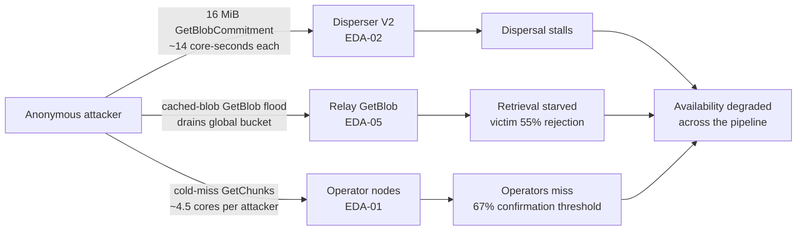
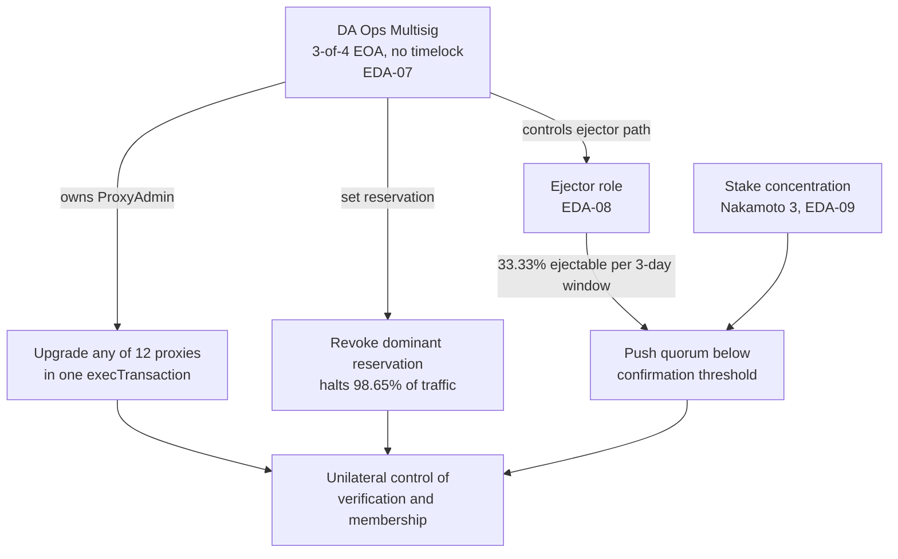
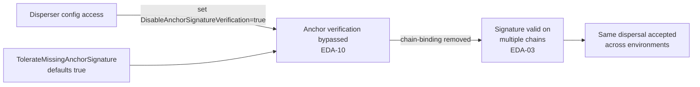

# EigenDA Attack Chains

This page documents three attack chains against EigenDA, constructed by composing individual threat findings. Compute and bandwidth figures come from the proof-of-concept measurements recorded on the referenced threat pages; governance parameters come from on-chain data (Ethereum mainnet `cast` calls, see [Verification Evidence](evidence.md)).

---

## Attack Chain A: Unauthenticated Pipeline Exhaustion

**Composed from:** EDA-01 (operator GetChunks cold-miss amplification), EDA-02 (Disperser KZG compute surface), EDA-05 (Relay GetBlob bandwidth starvation)

The three unauthenticated surfaces sit on the three stages of the data path — dispersal, distribution, and retrieval — so a single anonymous attacker can apply pressure to the whole pipeline at once.

### Preconditions

| Parameter | Value | Source |
|---|---|---|
| `GetBlobCommitment` auth | None (enabled by default) | EDA-02 |
| Disperser KZG cost | ~14 core-seconds per 16 MiB blob | EDA-02 |
| Relay rate limiter | Global-only, charged before cache lookup | EDA-05 |
| `GetChunks` auth | StoreChunks only; reads unauthenticated | EDA-01 |
| Operator cold-miss cost | ~4.5 cores per single attacker | EDA-01 |
| Registered relays | 1 (single relay key) | EDA-04 |

### Attack Steps

1. **Dispersal pressure**: The attacker sends repeated 16 MiB `GetBlobCommitment` requests to the Disperser. Each costs roughly 14 core-seconds of sequential KZG work, and the request context is not propagated to the computation, so client-side timeouts do not relieve the server.

2. **Distribution pressure**: In parallel, the attacker floods the single Relay's `GetBlob` endpoint with requests for an already-cached blob. Because bandwidth is charged against the global bucket before the cache lookup, the shared budget drains at near-zero backend cost, and legitimate clients lose more than half of their requests.

3. **Retrieval pressure**: The attacker issues `GetChunks` requests that miss the operator chunk cache. Cold misses return without debiting a rate-limit token, so a single attacker sustains roughly 4.5 cores of work on each targeted operator.

4. **Convergence**: With dispersal stalled, retrieval starved, and operators driven toward missing the 67% confirmation threshold, availability degrades across the whole pipeline without the attacker holding any credential or making any payment.

### Cost

| Component | Amount |
|---|---|
| Authentication | None required on any of the three surfaces |
| Payment | None (compute consumed before payment checks) |
| Infrastructure | Commodity client issuing well-formed gRPC requests |

### Impact

- Disperser CPU saturation stalls new dispersals for all tenants.
- The single registered relay cannot serve retrievals to legitimate clients.
- Operators driven below the 67% confirmation threshold cannot attest batches.
- Front-tier WAF/CDN layers do not help: the cost asymmetry is algorithmic, not volumetric.

---

## Attack Chain B: Single-Multisig Governance Seizure

**Composed from:** EDA-07 (single multisig controls core contracts), EDA-08 (ejector role), EDA-09 (stake concentration)

### Preconditions

| Parameter | Value | Source |
|---|---|---|
| Multisig scheme | 3-of-4 EOA Gnosis Safe, no timelock | EDA-07 |
| Contracts owned | 8 core contracts + 12 proxies via shared ProxyAdmin | EDA-07 |
| Dominant reservation share | 98.65% of mainnet dispersal traffic | EDA-04 supplementary |
| Ejectable stake per window | 33.33% per quorum per 3-day window | EDA-08 |
| Nakamoto coefficient (33%) | 3 (Q0 and Q1) | EDA-09 |

### Attack Steps

1. **Threshold capture**: Any 3 of the 4 multisig signers (private-key theft, collusion, or legal compulsion) can authorize an `execTransaction` with no timelock delay.

2. **Implementation swap**: The multisig owns the single ProxyAdmin for all 12 upgradeable proxies, so a single transaction can replace the implementation of the ServiceManager, RegistryCoordinator, or CertVerifierRouter.

3. **Traffic halt**: Because the multisig set the dominant disperser's PaymentVault reservation, it can revoke that reservation and instantly halt 98.65% of mainnet dispersal traffic.

4. **Membership pressure**: Through the ejector path, the multisig can eject up to 33.33% of a quorum's stake per 3-day window. Combined with a Nakamoto coefficient of 3, repeated windows can push a quorum below its 55% confirmation threshold.

### Cost

| Component | Amount |
|---|---|
| On-chain cost | Gas for `execTransaction` |
| Time delay | None (no timelock on owner actions) |
| Coordination | 3 of 4 signers |

### Impact

- A single 3-of-4 Safe can unilaterally upgrade verification logic, halt the dominant traffic source, and reshape operator membership.
- No timelock means there is no window for the community to react before an action takes effect.
- This is the concentration baseline that the Decentralization axis records; it is a structural governance condition, not an exploit.

---

## Attack Chain C: Anchor Bypass Enables Cross-Chain Replay

**Composed from:** EDA-10 (anchor verification disable flag), EDA-03 (cross-chain signature replay)

### Preconditions

| Parameter | Value | Source |
|---|---|---|
| `DisableAnchorSignatureVerification` | Defaults `false`, can be set `true` | EDA-10 |
| `TolerateMissingAnchorSignature` | Defaults `true` | EDA-10 |
| Anchor binding purpose | Binds a signature to a specific chain | EDA-03 |

### Attack Steps

1. **Configuration access**: An insider or supply-chain attacker with access to the Disperser environment sets `DisableAnchorSignatureVerification` to `true`, or relies on the default-true `TolerateMissingAnchorSignature` to accept requests that omit the anchor signature.

2. **Binding removed**: With anchor verification skipped, the chain-binding protection introduced after the Sigma Prime audit no longer applies.

3. **Replay**: A signature captured on one environment is replayed against another, since nothing now ties the signature to a specific chain. The same dispersal is accepted across environments.

### Cost

| Component | Amount |
|---|---|
| Privilege | Disperser configuration or environment access |
| External signal | None (no anchor errors surface in logs) |

### Impact

- Cross-environment replay of dispersal authorizations becomes possible.
- BLS signature verification remains active, which limits the blast radius to the anchor-binding property.
- The dependence on a privileged flag for a security control is recorded against the Verifiability baseline.

---

## Summary Matrix

| Attack Chain | Auth / Privilege | Impact Scope | Composed Findings | Assessment |
|---|---|---|---|---|
| A: Pipeline Exhaustion | None | Dispersal + distribution + retrieval | EDA-01, EDA-02, EDA-05 | Highest likelihood: fully unauthenticated, algorithmic cost |
| B: Governance Seizure | 3-of-4 signers | Verification, traffic, membership | EDA-07, EDA-08, EDA-09 | Highest impact: unilateral control, no timelock |
| C: Anchor Bypass | Config access | Cross-chain replay | EDA-10, EDA-03 | Targeted insider / supply-chain path |
