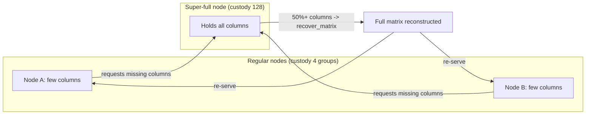

# ETH-05: Full-Data Reconstruction Depends on Nodes Holding at Least Half the Columns


**Severity**: Medium · **Category**: Operational Risk · **Status**: verified


## Summary

PeerDAS reconstructs the full data matrix only when a node obtains at least 50 percent of the columns, that is 64 of the 128. An honest node is required to custody only `CUSTODY_REQUIREMENT` custody groups, which maps to a small fraction of the columns, so an ordinary node cannot reconstruct on its own. Reconstruction and the ability to re-serve missing columns therefore rest on super-full nodes that custody all 128 columns, or on enough peers collectively holding 64 distinct columns. This is an operational dependence on well-provisioned nodes rather than a code defect.

## Description

The reconstruction threshold and the supernode role are both defined in the specification.

- A node that obtains 50 percent or more of all columns should reconstruct the full data matrix via the `recover_matrix` helper, which wraps `recover_cells_and_kzg_proofs`. Source: [das-core.md](https://github.com/ethereum/consensus-specs/blob/master/specs/fulu/das-core.md).
- `CUSTODY_REQUIREMENT` is 4 custody groups, and `NUMBER_OF_CUSTODY_GROUPS` is 128. An honest node custodies only the minimum unless it opts to hold more.
- A node may raise its custody count up to `NUMBER_OF_CUSTODY_GROUPS`, which the spec labels a super-full node holding every column.

Because the minimum-custody node holds far fewer than 64 columns, it cannot run `recover_matrix` from its own holdings. The practical guarantee that any missing column can be recovered and re-served depends on the presence of nodes that hold at least half the columns, and most directly on super-full nodes that hold all of them.

## Proof of Concept

No exploit reproduction was conducted. This finding is based on the Fulu specification: the 50 percent reconstruction threshold in `das-core.md`, the `CUSTODY_REQUIREMENT` of 4 custody groups, and the super-full node definition that sets custody to `NUMBER_OF_CUSTODY_GROUPS`.

## Impact

If super-full nodes are few and the remaining custody is sparsely distributed, a period in which several well-provisioned nodes are offline can leave the network unable to assemble 64 distinct columns for a given block, so missing columns cannot be reconstructed or re-served. This degrades retrieval and, in the worst case, the timely availability of a block's data. The condition is operational and depends on the live distribution of custody across the peer set rather than on any defect in the protocol logic.

Affects the Liveness and Retrievability axes. As an operational condition that depends on the live custody distribution rather than an exploitable defect, it is tracked as an Operational Indicator shown alongside the risk pentagon, not as a deduction from the structural score.

## Recommendation

1. Monitor the population and column coverage of super-full nodes, treating a decline in distinct-column coverage below the reconstruction threshold as an availability alert.
2. Encourage diversity in the operators running super-full nodes so reconstruction does not depend on a small set of providers.
3. Track per-column peer counts so that sparse coverage of any single column is detected before it threatens reconstruction.
