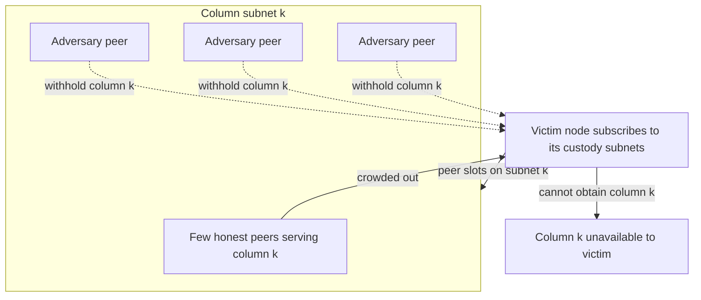

# ETH-06: Per-Column Subnet Coverage Gap Enables Targeted Column Eclipse


**Severity**: Medium · **Category**: Operational Risk · **Status**: verified


## Summary

PeerDAS distributes columns across 128 gossip subnets, and a minimum-custody node subscribes to only the subnets for the custody groups it holds. For any single column, such a node may have only a small number of honest peers serving it. An adversary that occupies enough of a node's peer slots on a specific column subnet can withhold that column from the node, producing a targeted per-column eclipse. The precise peer-count and timing conditions for a reliable eclipse are an open research question.

## Description

*Data flow — Ethereum PeerDAS Read: PeerDAS.*

The structural facts are defined by the specification.

- `DATA_COLUMN_SIDECAR_SUBNET_COUNT` is 128: column sidecars are gossiped on a per-column subnet. Source: [p2p-interface.md](https://github.com/ethereum/consensus-specs/blob/master/specs/fulu/p2p-interface.md).
- A node custodies `CUSTODY_REQUIREMENT` groups by default, so it subscribes to a small set of column subnets and relies on a limited peer set for each column.

When the honest peer set for a particular column on a node is small, an adversary that controls a sufficient number of that node's peer connections on the corresponding subnet can decline to forward the column. If the victim cannot obtain the column from any honest peer and cannot reconstruct, it lacks that column locally. The feasibility of forcing and sustaining this state depends on peer-selection behavior, peer-count limits, and discovery timing, which are not fully characterized for mainnet conditions and remain an open research question.

## Proof of Concept

No exploit reproduction was conducted. This finding is based on the per-column subnet structure in `p2p-interface.md` and the minimum-custody subscription model in `das-core.md`. The conditions under which a per-column eclipse can be reliably forced and sustained are an open research question and are not asserted here as confirmed-exploitable.

## Impact

A node subjected to a per-column eclipse cannot see one or more columns it expects to sample or custody. Depending on client behavior, this can cause the node to treat a block's data as unavailable, withhold its attestation, or fall back to reconstruction it cannot perform from its own holdings. The effect is scoped to individual targeted nodes and depends on an adversary's ability to occupy a victim's peer slots on specific subnets, rather than on a flaw in the protocol logic.

Affects the Liveness and Verifiability axes. As an operational condition contingent on peer-topology control rather than an exploitable code defect, it is tracked as an Operational Indicator shown alongside the risk pentagon, not as a deduction from the structural score.

## Recommendation

1. Maintain a healthy minimum count of distinct honest peers per custody subnet and alert when per-column peer coverage falls below a safe threshold.
2. Diversify peer discovery and selection so that an adversary cannot easily fill a node's peer slots on a single column subnet.
3. Treat the timing and peer-count thresholds for a reliable per-column eclipse as an open research item warranting dedicated measurement on mainnet topology.
