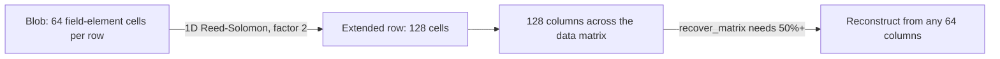

# ETH-10: PeerDAS Uses One-Dimensional Erasure Coding


**Category**: Design Note · **Status**: verified


## Summary

PeerDAS extends each blob with a one-dimensional erasure code at an extension factor of two, taking the data from 64 to 128 cells per row, organized into 128 columns. This is a deliberate design choice for the deployed protocol. Two-dimensional coding, which would change the sampling and reconstruction guarantees, is not part of the shipped specification. The single-dimension scheme is the documented basis for PeerDAS reconstruction and sampling, and it sets the Retrievability and Verifiability design baseline for Ethereum.

## Description

The coding scheme is fixed by the specification.

- The blobs are extended using a one-dimensional erasure coding extension. Source: [das-core.md](https://github.com/ethereum/consensus-specs/blob/master/specs/fulu/das-core.md) and [EIP-7594](https://eips.ethereum.org/EIPS/eip-7594).
- The extension factor is two: `FIELD_ELEMENTS_PER_EXT_BLOB` is `2 * FIELD_ELEMENTS_PER_BLOB`, so 64 original cells per row become 128.
- Reconstruction of the full matrix requires at least 50 percent of the columns, that is 64 of 128, via `recover_matrix`.

Because the code is one-dimensional, the availability argument rests on column-level distribution and the 50 percent reconstruction threshold rather than on the row-and-column sampling that a two-dimensional scheme would provide. This is an acknowledged property of the current design, not a divergence between specification and implementation.

## Proof of Concept

No exploit reproduction was conducted. This is a design note recording the one-dimensional erasure coding scheme and its extension factor as specified in `das-core.md` and EIP-7594.

## Impact

The one-dimensional scheme determines how the data availability guarantee is constructed: a column is recoverable when at least half the columns are present, and sampling reasons over columns rather than over a two-dimensional grid. Any assessment of PeerDAS retrievability and verifiability must take this single-dimension design as the baseline, since the protocol does not currently offer the stronger sampling properties associated with two-dimensional coding.

Sets the Retrievability and Verifiability Design Baselines through the erasure-coding sub-property. As an acknowledged design choice in the deployed specification, it carries no score.

## Recommendation

1. Anchor retrievability and verifiability assessments to the one-dimensional scheme and its 50 percent reconstruction threshold.
2. Treat any future move to two-dimensional coding as a baseline change to be re-evaluated when and if it is specified.
