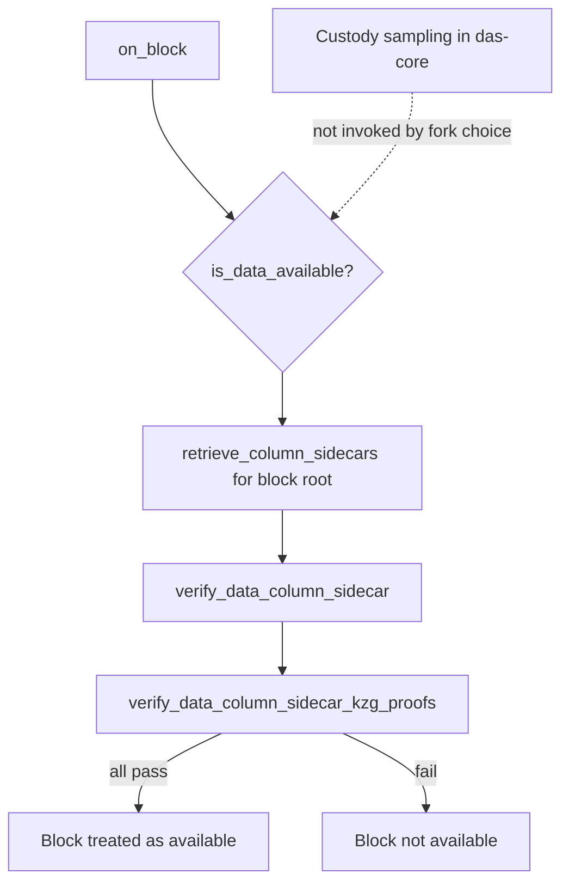

# ETH-11: Fork-Choice Data Availability Rests on Custody, Not Peer Sampling


**Category**: Design Note · **Status**: verified


## Summary

In the deployed PeerDAS design, the fork-choice availability check verifies the column sidecars a node has retrieved for its own custody and confirms their KZG proofs. It does not invoke a probabilistic peer-sampling routine, and there is no separate peer-sampling specification gating consensus. A node's decision that a block's data is available therefore rests on its custody set and KZG verification rather than on the kind of randomized sampling the name data availability sampling implies. This is the documented basis of the verifiability baseline for Ethereum.

## Description

The availability gate is custody-based and KZG-verified.

- `on_block` asserts `is_data_available`, which calls `retrieve_column_sidecars` for the block root and verifies each sidecar with `verify_data_column_sidecar` and `verify_data_column_sidecar_kzg_proofs`. Source: [fork-choice.md](https://github.com/ethereum/consensus-specs/blob/master/specs/fulu/fork-choice.md).
- Custody sampling is described in [das-core.md](https://github.com/ethereum/consensus-specs/blob/master/specs/fulu/das-core.md) and is not invoked by the fork-choice availability check. There is no separate peer-sampling specification in the Fulu folder that gates fork choice.

The result is that the security argument for availability is built from custody coverage plus cryptographic verification of held columns, combined with the one-dimensional erasure code and the reconstruction threshold. Probabilistic peer sampling, in which a node queries random columns it does not custody and infers availability, is not the mechanism that currently decides fork choice.

## Proof of Concept

No exploit reproduction was conducted. This is a design note recording that `is_data_available` in `fork-choice.md` checks retrieved custody sidecars and their KZG proofs, and that custody sampling in `das-core.md` is not invoked by the fork-choice gate.

## Impact

Any verifiability assessment of PeerDAS must treat the availability guarantee as custody-and-verification based rather than sampling based. The strength of the guarantee follows from how widely custody is distributed and from KZG correctness of held columns, not from the statistical confidence of randomized sampling. Describing the present design as sampling-gated would overstate the delivered mechanism, so the baseline credits custody-based availability as specified.

Sets the Verifiability Design Baseline through the availability-decision sub-property. As an acknowledged property of the deployed specification, it carries no score.

## Recommendation

1. Frame the PeerDAS availability guarantee as custody-and-KZG based when reasoning about verifiability.
2. Re-evaluate the baseline if and when a peer-sampling mechanism is specified to gate fork choice.
