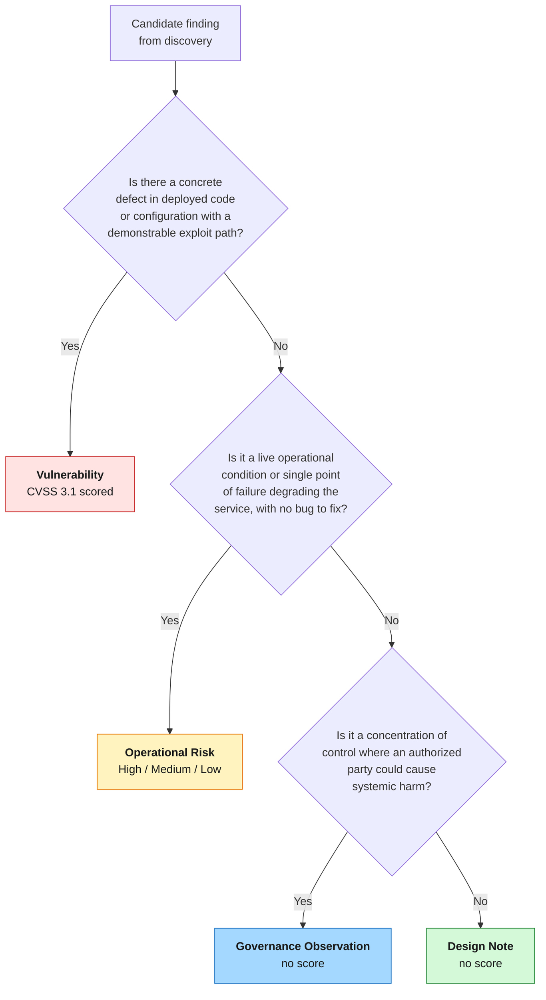

# Threat Classification

Discovery produces a flat list of candidate findings. Classification sorts each one into exactly one of four tiers. The tier determines how the finding is treated: whether it carries a CVSS score, whether it sets a structural baseline, and how it feeds the 5-axis risk model. Keeping these distinct prevents an architectural trade-off or a trust-distribution observation from being mislabeled as an exploitable bug.

---

## The Four Tiers

| Tier | What It Is | Carries CVSS? | GitBook Hint Style |
|------|------------|:-------------:|--------------------|
| **Vulnerability** | A concrete defect in deployed code or configuration with a demonstrable exploit path | Yes (CVSS 3.1) | `warning` (High/Critical), `info` (Medium/Low), `danger` (Critical) |
| **Operational Risk** | A live operational condition or single point of failure that degrades the service without an attacker exploiting a bug | No — qualitative High/Medium/Low | `warning` (High), `info` (Medium/Low) |
| **Governance Observation** | A concentration of control or trust such that an authorized party could cause systemic harm | No | `info` |
| **Design Note** | A documented architectural choice or specification-level property that bounds what the protocol can structurally guarantee | No | `success` |

---

## Decision Flow

Each candidate finding is classified by answering four questions in order.



---

## Tier Definitions

### Vulnerability

A Vulnerability is a concrete defect in code or configuration that an attacker can exploit through a demonstrable path. It can, in principle, be patched. Vulnerabilities are the only tier that carries a CVSS 3.1 score, and they are the only tier that produces a deduction in the 5-axis model.

**Criteria:**
- A specific code path or configuration value is at fault.
- An attacker with stated privileges can trigger a concrete impact.
- A fix is possible without redesigning the protocol.

**Examples:**
- **CEL-01** — A transaction-cache key mismatch lets a crafted transaction grow validator memory without bound, crashing the node.
- **AVL-02** — A proxy-wrapped `submitData` call emits a data-submitted event while the runtime silently skips Kate proof generation, so data appears committed but is unverifiable.
- **EDA-02** — The Disperser recomputes KZG commitments before checking payment, exposing an unauthenticated compute-exhaustion path.

### Operational Risk

An Operational Risk is a live operational condition — a single point of failure, a missing redundancy, or a fragile dependency — that degrades the service. There is no bug to patch; the risk is a property of how the system is currently operated. Operational Risks are rated qualitatively as High, Medium, or Low.

**Criteria:**
- The risk arises from operation or deployment, not from a code defect.
- No single attacker action exploits a flaw; the condition itself is the risk.
- Mitigation typically means adding redundancy or changing operational practice, not patching code.

**Examples:**
- **EDA-04** — A single registered Relay serves all blob retrieval traffic; its failure halts the primary read path.
- **EDA-05** — Blob retrieval is unauthenticated and rate-limited only globally, so one client can crowd out others.
- **ETH-05** — Full reconstruction of a column set depends on at least one supernode being present and honest.

### Governance Observation

A Governance Observation records a concentration of control or trust where a party operating entirely within its granted authority could nonetheless cause systemic harm. No boundary is crossed and no bug is exploited; the concentration itself is the risk. Governance Observations carry no score. They inform the Decentralization baseline in the 5-axis model and, where a stated property is not actually delivered, they correct the baseline.

**Criteria:**
- Control over governance, operators, or infrastructure is concentrated.
- The harmful action would be authorized, not an exploit.
- The finding describes who could break the system, not a flaw that lets them.

**Examples:**
- **EDA-07** — A single 3-of-4 multisig owns all eight core EigenDA contracts with no timelock.
- **CEL-08** — The validator set is KYC-verified and concentrated, creating a coordinated-censorship vector within a few jurisdictions.
- **ETH-07** — A node's custody count is self-reported in its ENR and cannot be independently verified.

### Design Note

A Design Note documents an architectural choice or a specification-level property that bounds what the protocol can structurally guarantee. It is not a defect and not a concentration risk; it is the documented basis for a baseline. Design Notes carry no score and set the Design Baseline in the 5-axis model.

**Criteria:**
- The finding describes a deliberate or specification-level property of the protocol.
- It is the documented reason a baseline is set where it is.
- It is addressed by protocol evolution, not by a patch.

**Design Notes have two sub-types:**

| Sub-type | Meaning | Example |
|----------|---------|---------|
| **Acknowledged Choice** | The protocol deliberately omits or defers a property, and this is a known and documented design decision. | **EDA-12** — EigenDA has no data availability sampling by design; clients trust the quorum. **ETH-10** — PeerDAS uses 1D erasure coding, with 2D sampling deferred to a future upgrade. |
| **Spec-Implementation Gap** | The specification or documentation claims a property that the deployed implementation does not deliver. The baseline cannot credit the claim. | **AVL-11** — Avail ships full slashing infrastructure, but no slash has ever been applied, so the dishonesty deterrent is not delivered. **CEL-10** — Celestia documentation advertises a fraud-proof security model and slashing parameters that the implementation no longer matches. |

The Spec-Implementation Gap sub-type is what allows the 5-axis baseline to stay honest: a property that is claimed but not delivered does not earn baseline credit.

---

## Hint Box Format per Tier

Every threat page opens with a GitBook hint box. The metadata line and style depend on the tier.

**Vulnerability:**
```

**Severity**: High (7.8/10) · **Category**: Vulnerability · **Status**: poc_verified

```

**Operational Risk:**
```

**Severity**: High · **Category**: Operational Risk · **Status**: verified

```

**Governance Observation:**
```

**Category**: Governance Observation · **Status**: verified

```

**Design Note:**
```

**Category**: Design Note · **Status**: verified

```

Only Vulnerability pages include a `### CVSS 3.1` section. For the other three tiers, severity is expressed qualitatively or omitted, and the page states which 5-axis property the finding affects in prose.

---

## Why the Tiers Matter for Scoring

The four tiers map directly onto the layers of the 5-axis risk model:

| Tier | Role in the 5-Axis Model |
|------|--------------------------|
| **Vulnerability** | Layer 3 — Threat Deduction. Reduces the axis baseline while unpatched. |
| **Operational Risk** | Layer 2 — Operational Indicator. Shown alongside the score, not folded into it. |
| **Governance Observation** | Layer 1 input and Layer 4 correction. Informs the Decentralization baseline; corrects baselines where a property is claimed but not delivered. |
| **Design Note** | Layer 1 — Design Baseline. Sets the structural starting point for each axis. |

This is why a finding's tier is not cosmetic. A finding classified as a Vulnerability deducts from a score; the same observation classified as a Design Note sets a baseline instead. The full model is described in [5-Axis Risk Scoring](scoring.md).
