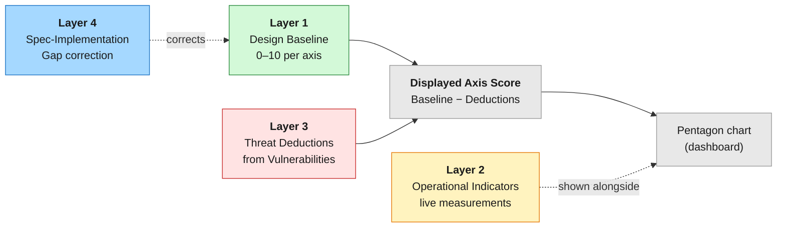
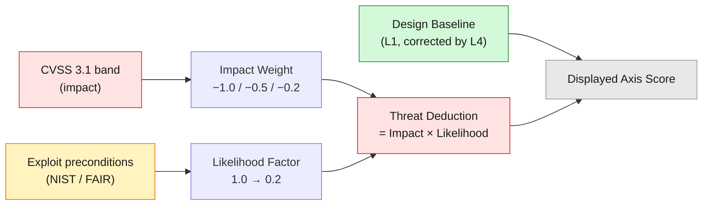

# 5-Axis Risk Scoring

CVSS scores individual vulnerabilities. It does not answer the question a rollup operator actually asks: *how does this DA layer compare to that one, across everything that matters?* BONDA's 5-axis model answers that question by evaluating every DA layer against the same five properties, using the same rubric.

This page explains the model: the five axes, the layered architecture that keeps structural properties separate from live measurements, the sub-property rubrics, and how the four classification tiers feed in. 


**Per-DA scores and pentagon charts live in the BONDA dashboard, not in this documentation.** This page defines *how* the model works. The dashboard renders the computed values for each DA layer. Keeping the methodology and the numbers separate means the rubric can be reviewed on its own terms, and the dashboard can update measurements without rewriting the documentation.


---

## The Five Axes

Each axis answers one question a DA user would ask.

| Axis | Question |
|------|----------|
| **Retrievability** | Can I get my data back when I need it? |
| **Verifiability** | Can I independently prove the data is really there? |
| **Liveness** | Will the service keep running under adversarial conditions? |
| **Decentralization** | How many parties would need to collude to break it? |
| **Cost Efficiency** | Is it affordable, predictable, and efficient for the throughput I need? |

These five capture the dimensions on which DA layers genuinely differ. A DA layer can be cheap but centralized, or decentralized but slow to retrieve from; one number cannot express that trade-off, but a pentagon can.

---

## Layered Architecture

A naive model would map each finding to an axis and subtract. That produces a number nobody can explain, because it mixes four different kinds of analysis: what the protocol structurally guarantees, what an attacker can degrade today, what the system is currently measuring, and whether the protocol delivers what it claims. BONDA separates them into four layers.



### Layer 1 — Design Baseline

*What does the protocol's architecture structurally guarantee?* Determined by the specification and the deployed design. It changes only when the protocol upgrades. Each axis baseline is built from three sub-properties, each scored 0–3, summed and rescaled to 0–10.

### Layer 3 — Threat Deductions

*How much can an attacker degrade this property right now?* Only **Vulnerability**-tier findings produce deductions, and only while the vulnerability remains unpatched. Each vulnerability is mapped to the axis its exploit most directly degrades. Axes with no genuinely matching vulnerability take no deduction — Decentralization and Cost Efficiency are baseline-only for this reason, never assigned a forced mapping. The deduction magnitude combines two independent dimensions — **impact** and **likelihood** — explained in [Impact and Likelihood](#impact-and-likelihood) below.

### Layer 2 — Operational Indicators

*Is the system currently performing as designed?* Live measurements from monitoring — dead-operator ratios, stake concentration, latency. These are displayed alongside the pentagon as color-coded alerts but are **not** folded into the score. This prevents a moving measurement from appearing to change a structural property.

### Layer 4 — Spec-Implementation Gap correction

*Does the system deliver what it claims?* When a protocol claims a property the implementation does not deliver, the baseline cannot take the claim at face value. Layer 4 findings reduce the baseline so it reflects delivered behavior, not documented intent.

### Score Formula

```
Displayed Axis Score = Design Baseline (Layer 1, corrected by Layer 4)
                       − Σ Threat Deductions (Layer 3)

Threat Deduction = Impact Weight × Likelihood Factor

Operational Indicators (Layer 2) = shown alongside, never in the number
```

---

## Impact and Likelihood

CVSS measures **impact assuming the attack succeeds**. It does not measure how *likely* the attack is to happen in the first place — its specification states the Base score is "not a measure of risk." A high-impact finding that is realistically improbable should not collapse an axis the way a routinely exploitable one does. So each deduction multiplies an impact weight by a likelihood factor.

### Impact Weight

Derived from the CVSS 3.1 severity band of the Vulnerability.

| CVSS band | Impact weight |
|-----------|---------------|
| High / Critical | −1.0 |
| Medium | −0.5 |
| Low | −0.2 |

### Likelihood Factor

A separate judgment of how realistically the exploit occurs, scored on the NIST SP 800-30 Rev.1 ordinal scale and informed by the FAIR frequency lens. It is assigned from the exploit's structural preconditions, not from its impact.

| Likelihood | Factor | Typical profile |
|------------|--------|-----------------|
| Very High | 1.0 | Unauthenticated, network-reachable, live, reproducible on demand |
| High | 0.8 | Reachable with minor preconditions; no privileged access required |
| Moderate | 0.6 | Requires a specific code path, transaction shape, or timing window |
| Low | 0.4 | Requires rare conditions or a misconfiguration the operator controls |
| Very Low | 0.2 | Build-time supply-chain, privileged-key, or governance-only trigger |

A consequence by design: an unauthenticated compute-exhaustion bug that any client can fire (Very High) deducts its full impact weight, while a bug reachable only through a compromised signing key or a build-time supply-chain step (Very Low) deducts a fifth of it. The same CVSS score can therefore produce very different axis deductions — which is the point.

The total deduction on any single axis is capped at −3.0 so that one heavily studied layer is not driven to zero by deduction stacking.

### Why likelihood is not folded into CVSS

CVSS 3.1's Exploitability sub-metrics (Attack Vector, Attack Complexity, Privileges Required, User Interaction) measure how *easy* an attack is once attempted, not how *often* it will realistically be attempted. Improbable-but-severe events — a signing-key compromise, a cloud-region outage, a regulatory censorship order — score high on CVSS impact yet rarely occur. Those events are captured as Governance Observations and Operational Risks, which never produce Layer 3 deductions; the likelihood factor handles the same realism concern for the Vulnerabilities that do deduct.



---

## Sub-Property Rubrics

Each axis baseline is the sum of three sub-properties. Each sub-property is scored on an integer 0–3 scale:

- **0** — Property absent or fundamentally broken.
- **1** — Property exists but with significant structural limitations.
- **2** — Property implemented with minor gaps.
- **3** — Property fully implemented and production-verified.

The raw sum (0–9) is rescaled to a 0.0–10.0 baseline: `baseline = (raw_sum / 9) × 10`.

### Retrievability

| # | Sub-property | Question |
|---|--------------|----------|
| R1 | Data redundancy | Is data erasure-coded, and can it be reconstructed from a subset? |
| R2 | Retrieval path independence | How many independent paths exist to retrieve data? |
| R3 | Sampling vs. full-download | Can availability be verified without downloading the full blob? |

### Verifiability

| # | Sub-property | Question |
|---|--------------|----------|
| V1 | Independent verification mechanism | Can a third party verify DA without trusting operators? |
| V2 | Bridge / settlement verification | How is DA attestation verified on the settlement layer? |
| V3 | Dishonesty deterrent | Is there an economic penalty for operators who lie about storing data? |

### Liveness

| # | Sub-property | Question |
|---|--------------|----------|
| L1 | Consensus / service continuity | What is the economic cost to halt the DA service? |
| L2 | Write path resilience | Can data still be submitted if a single component fails? |
| L3 | Read path resilience | Can data still be retrieved if a single component fails? |

### Decentralization

| # | Sub-property | Question |
|---|--------------|----------|
| D1 | Operator / validator distribution | How many independent entities participate, and how is power distributed? |
| D2 | Governance concentration | Can a small group unilaterally upgrade or control the system? |
| D3 | Software & infrastructure diversity | Are there multiple independent implementations and hosting providers? |

### Cost Efficiency

| # | Sub-property | Question |
|---|--------------|----------|
| C1 | Fee predictability | Can users budget for DA costs, or are fees volatile? |
| C2 | Blockspace manipulation resistance | How expensive is it to monopolize DA blockspace? |
| C3 | Throughput capacity | How much data can the layer process, and at what integration overhead? |

Each sub-property has its own 0–3 scoring guide. The dashboard records the assigned level and the primary-source evidence behind it for every DA layer.

---

## The Classification Bridge

The four tiers from [Threat Classification](classification.md) are not just labels — each tier enters the model at a specific layer. This is the reason classification comes before scoring.

| Tier | Enters at | Effect on the score |
|------|-----------|---------------------|
| **Design Note** | Layer 1 | Sets the Design Baseline. An acknowledged choice fixes where a sub-property starts. |
| **Governance Observation** | Layer 1 input + Layer 4 | Informs the Decentralization baseline; corrects any baseline where a claimed property is not delivered. |
| **Operational Risk** | Layer 2 | Displayed as an operational indicator alongside the pentagon, never folded into the number. |
| **Vulnerability** | Layer 3 | Produces a deduction from the relevant axis baseline while unpatched. |

A worked consequence: EigenDA's absence of data availability sampling is classified as a **Design Note**, so it sets the Retrievability and Verifiability baselines low — it is not double-counted as a vulnerability deduction. By contrast, a Disperser compute-exhaustion bug is a **Vulnerability**, so it produces a Liveness deduction that disappears once patched. The same protocol fact would distort the score if it were filed under the wrong tier; the bridge is what keeps the model coherent.

---

## How the Model Handles Uneven Threat Counts

Threat counts differ across DA layers because research depth differs, not because one layer is inherently safer. A model that mapped threat count to score would punish the most-studied layer. The layered architecture avoids this in three ways:

1. **Baselines are architectural, not count-based.** A sub-property is scored from design facts — number of client implementations, presence of slashing, retrieval topology — regardless of how many threat pages were written.
2. **Only Vulnerabilities deduct.** Governance Observations and Design Notes shape the baseline; they do not create separate penalties. A well-documented design omission is reflected once, in the baseline.
3. **Operational measurements are separated.** Live metrics inform the alert panel, not the structural score.

The result is a comparison that reflects each protocol's architecture rather than the accident of where analysis effort was concentrated.
