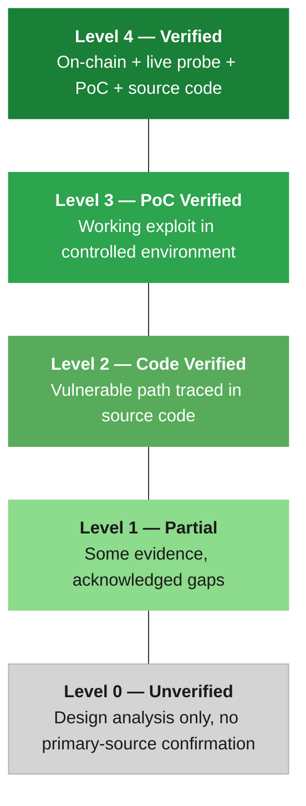
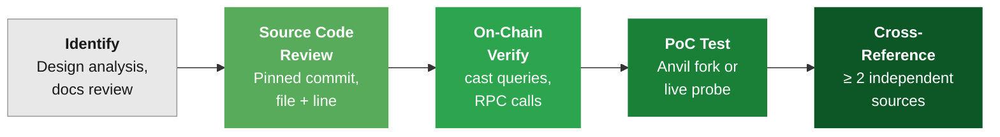

# Verification Approach

BONDA backs every finding with primary-source evidence. This page explains the verification levels, evidence sources, and cross-reference methodology.

---

## Verification Levels

Every threat receives one of four verification levels. Higher levels include all evidence from lower levels.



### Level Definitions

| Level | Label | What It Means | Example |
|:-----:|-------|---------------|---------|
| **4** | `verified` | The threat has been confirmed against production infrastructure. Evidence includes on-chain state, live probes, source code, and often a PoC. | Queried `hasRole()` on mainnet, confirmed unauthenticated gRPC access, traced the code path, ran a fork test. |
| **3** | `poc_verified` | A working Proof of Concept demonstrates the attack mechanism in a controlled environment such as an Anvil mainnet fork. Live mainnet exploitation was not performed. | Forked mainnet with Anvil, executed the upgrade path, confirmed state change in the fork. |
| **2** | `code_verified` | The vulnerable code path has been traced at a pinned commit with file paths and line numbers. No live exploitation or PoC was run. | Located the flag default in `flags.go:251`, confirmed no authentication middleware in the handler chain. |
| **1** | `partial` | Some evidence supports the finding, but environmental factors or defense boundaries prevent full confirmation. Gaps are documented. | Documentation describes a feature, but the relevant code is in a private repository and cannot be audited. |
| **0** | `unverified` | The threat is identified through design analysis or documentation review but lacks primary-source confirmation. These are known risk areas that could not be independently tested. | A cryptographic trusted setup assumption where the ceremony data is not publicly auditable. |

### Distribution Across Protocols

| Protocol | Verified (L4) | PoC Verified (L3) | Code Verified (L2) | Partial (L1) | Unverified (L0) |
|----------|:-------------:|:------------------:|:-------------------:|:-------------:|:---------------:|
| EigenDA  | 12 | -- | 4 | 1 | -- |
| Celestia | 5  | 4  | 8 | 2 | -- |
| Avail    | 12 | -- | -- | -- | 2 |
| Ethereum | 6  | -- | 3 | 2 | -- |

---

## Verification Process

Each threat follows a consistent verification flow. Not every threat reaches every stage — the process stops when evidence is sufficient or when access limitations prevent further confirmation.



| Stage | Action | Output |
|-------|--------|--------|
| **Identify** | Review protocol design docs, audit reports, and architecture. Flag potential attack surfaces. | Candidate threat with hypothesis. |
| **Source Code Review** | Trace the relevant code path at a pinned commit. Record file paths, line numbers, flag defaults, and control flow. | Code evidence at a specific commit hash. |
| **On-Chain Verify** | Query deployed contract state with `cast` or Substrate RPC. Confirm role assignments, parameters, and account types. | On-chain evidence at a specific block number. |
| **PoC Test** | Run a Proof of Concept on an Anvil mainnet fork or probe live endpoints with `grpcurl`. | Reproducible test or probe transcript. |
| **Cross-Reference** | Validate the finding against at least two independent sources. Confirm that evidence from different stages is consistent. | Final verification level assigned. |

---

## Evidence Sources

BONDA uses four types of primary-source evidence. All evidence is pinned to a specific commit hash or block number so that findings can be independently reproduced.

### 1. Source Code at Pinned Commits

All code references point to specific commits with file paths and line numbers.

| What We Look For | Example |
|------------------|---------|
| Flag defaults and their implications | `cli.BoolTFlag` vs. `cli.BoolFlag` in `flags.go:251` |
| Authentication and authorization paths | Presence or absence of auth middleware in handler chains |
| Deployment script omissions | Commented-out `revokeRole()` calls in `Guardian.s.sol` |
| Access control configuration | Role-based access in Solidity contracts |

**Reference format:**
```
code:disperser/cmd/apiserver/flags/flags.go:251-256
code:contracts/src/periphery/ejection/EigenDAEjectionManager.sol
```

### 2. On-Chain State via cast / RPC

Contract state is queried directly using `cast` from the Foundry toolkit or Substrate RPC calls. This captures the actual deployed configuration, not what documentation claims.

| Query Type | Command | What It Reveals |
|-----------|---------|-----------------|
| Role assignment | `cast call <contract> "hasRole(bytes32,address)" <role> <addr>` | Whether a role is actually granted |
| Role hierarchy | `cast call <contract> "getRoleAdmin(bytes32)" <role>` | Which role controls another |
| Account type | `cast code <address>` | EOA (`0x`) vs. contract (non-zero) |
| Account activity | `cast nonce <address>` | Whether the account is actively used |
| Contract parameters | `cast call <contract> "functionName()"` | Deployed thresholds, timelocks, counts |

### 3. Live Network Probes

Mainnet nodes and public endpoints are probed to confirm whether theoretical attack surfaces are exposed in production.

| Probe Type | Tool | What It Reveals |
|-----------|------|-----------------|
| gRPC service enumeration | `grpcurl <host>:443 list` | Which services are publicly exposed |
| Unauthenticated access test | `grpcurl <host>:443 <service>/<method>` | Whether endpoints require authentication |
| Validator behavior | Public APIs | Operator counts, stake distribution, infrastructure concentration |

### 4. Anvil Mainnet Fork PoC Tests

Proof of Concepts run on Anvil mainnet forks to demonstrate exploitability without affecting production systems.

| Component | Description |
|-----------|-------------|
| Fork setup | `anvil --fork-url <rpc>` at a pinned block number |
| Attack script | Shell or Python script that executes the exploit steps |
| Verification | State queries before and after to confirm the attack succeeded |

---

## Cross-Reference Methodology

Every finding must be traceable to at least two independent sources. A code comment claiming a feature exists is not evidence if on-chain state contradicts it.

| Primary Source | Cross-Referenced Against | What It Validates |
|----------------|--------------------------|-------------------|
| Source code flag default | Live probe response behavior | Whether the default actually applies in production |
| Deployment script | On-chain `hasRole` query | Whether roles were actually granted or revoked as scripted |
| Documentation claim | Source code path audit | Whether documented security features are implemented |
| Audit report fix | Current commit code review | Whether the fix was applied and remains in place |
| On-chain parameter | Source code constant | Whether the deployed value matches the intended configuration |


**Single-source findings are flagged.** If a threat can only be confirmed through one evidence type, it receives `partial` status and the limitation is documented explicitly.


---

## Example: AVL-E03 — Deployer Admin Role

**Threat:** The deployer EOA for Avail's VectorX bridge contract retains `DEFAULT_ADMIN_ROLE`, enabling a solo upgrade path that bypasses multisig governance.

**Verification level:** `verified` (Level 4) — four independent sources.

### Step 1 — On-chain role query

Three roles were checked for the deployer EOA using `cast call` against the live VectorX contract:

```
Deployer: 0xDEd0000E32f8F40414d3ab3a830f735a3553E18e

hasRole(DEFAULT_ADMIN_ROLE, deployer) = true   ← should be false
hasRole(TIMELOCK_ROLE, deployer)      = false
hasRole(GUARDIAN_ROLE, deployer)      = false
```

### Step 2 — Role hierarchy confirmation

```
getRoleAdmin(TIMELOCK_ROLE) = 0x00   → DEFAULT_ADMIN_ROLE
```

`DEFAULT_ADMIN_ROLE` controls `TIMELOCK_ROLE`. The deployer can grant itself any role.

### Step 3 — Account type verification

```
cast code 0xDEd... = 0x       → EOA, not a multisig
cast nonce 0xDEd... = 1107    → actively used account
```

### Step 4 — Source code cross-reference

The deployment script `Guardian.s.sol` in the `sp1-vector` repository was examined. The line that should revoke `DEFAULT_ADMIN_ROLE` from the deployer is commented out. This is not a deployment accident — it is a code-level omission that persists in the repository.

### Result

The attack path is confirmed viable:

```
deployer → grantRole(TIMELOCK_ROLE, self) → upgradeTo(malicious_impl)
```

Four independent sources corroborate the finding: on-chain role state, role hierarchy, account type, and source code review.
