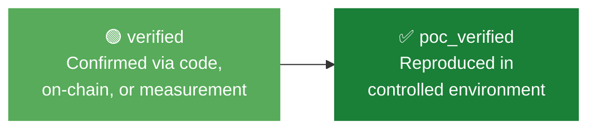

# Verification Approach

BONDA backs every finding with primary-source evidence. This page explains the verification levels and the verification process.

***

## Verification Levels

Every finding is assigned one of two verification levels based on the strength of evidence collected.

| Level | Label          | Meaning                                                                                                                                                                   |
| :---: | -------------- | ------------------------------------------------------------------------------------------------------------------------------------------------------------------------- |
|   L2  | `poc_verified` | Attack was reproduced in a controlled environment such as an Anvil fork, an inabox deployment, or a live probe. Strongest evidence.                                       |
|   L1  | `verified`     | Existence confirmed through source code analysis at a pinned commit, on-chain state queries, data measurement, or specification review. Standard level for most findings. |


```mermaid
flowchart LR
    V["🟢 verified<br/>Confirmed via code,<br/>on-chain, or measurement"]
    P["✅ poc_verified<br/>Reproduced in<br/>controlled environment"]

    V --> P

    style V fill:#57ab5a,color:#fff,stroke:#57ab5a
    style P fill:#1a7f37,color:#fff,stroke:#1a7f37
```

### Level Definitions

**`verified`** is the standard level. A finding reaches this level when its existence is confirmed through at least one concrete evidence source: tracing a vulnerable code path at a pinned commit, querying on-chain state with `cast call`, measuring live network data, or reviewing an authoritative specification against actual behavior. The distinction between static and dynamic analysis does not matter for this level — what matters is that the finding demonstrably holds.

**`poc_verified`** is the highest level. A finding reaches this level when the attack or condition is reproduced end-to-end in a controlled environment. This typically means running an exploit script on an Anvil mainnet fork, an inabox deployment, or a measured load test that demonstrates a state change, a crash, a degradation, or an unauthorized action. Reproduction provides the strongest possible evidence.

### Examples

**`verified`** — AVL-06 Deployer Admin Role (Governance Observation):

```
cast call 0x02993... "hasRole(bytes32,address)" <ADMIN> <deployer>
→ Returns: true

The deployer wallet retains admin access on mainnet.
This is confirmed on-chain state, not theoretical.
```

**`verified`** — EDA-10 Anchor Verification Disable Flag (Governance Observation):

```
Found DisableAnchorSignatureVerification flag in flags.go:251.
Default is false, but setting it to true skips all anchor checks.
The bypass path exists in source code at a pinned commit.
```

**`poc_verified`** — CEL-01 TxCache Key Mismatch (Vulnerability):

```
Reproduced on a controlled node: injected a crafted transaction that
exploited the key mismatch, growing validator memory until the node crashed.
The attack is reproducible end-to-end.
```

**`poc_verified`** — AVL-03 Kate RPC Unauthenticated KZG DoS (Vulnerability):

```
Issued concurrent kate_queryProof requests against a Kate-RPC-enabled node.
50 concurrent requests produced an 8.4x wall-time increase with no auth or
rate limit. Confirmed active on a public mainnet RPC endpoint.
```
